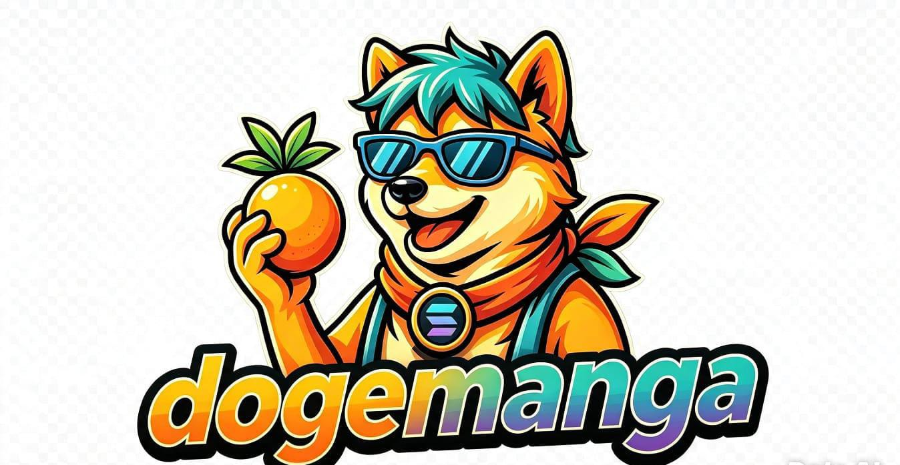
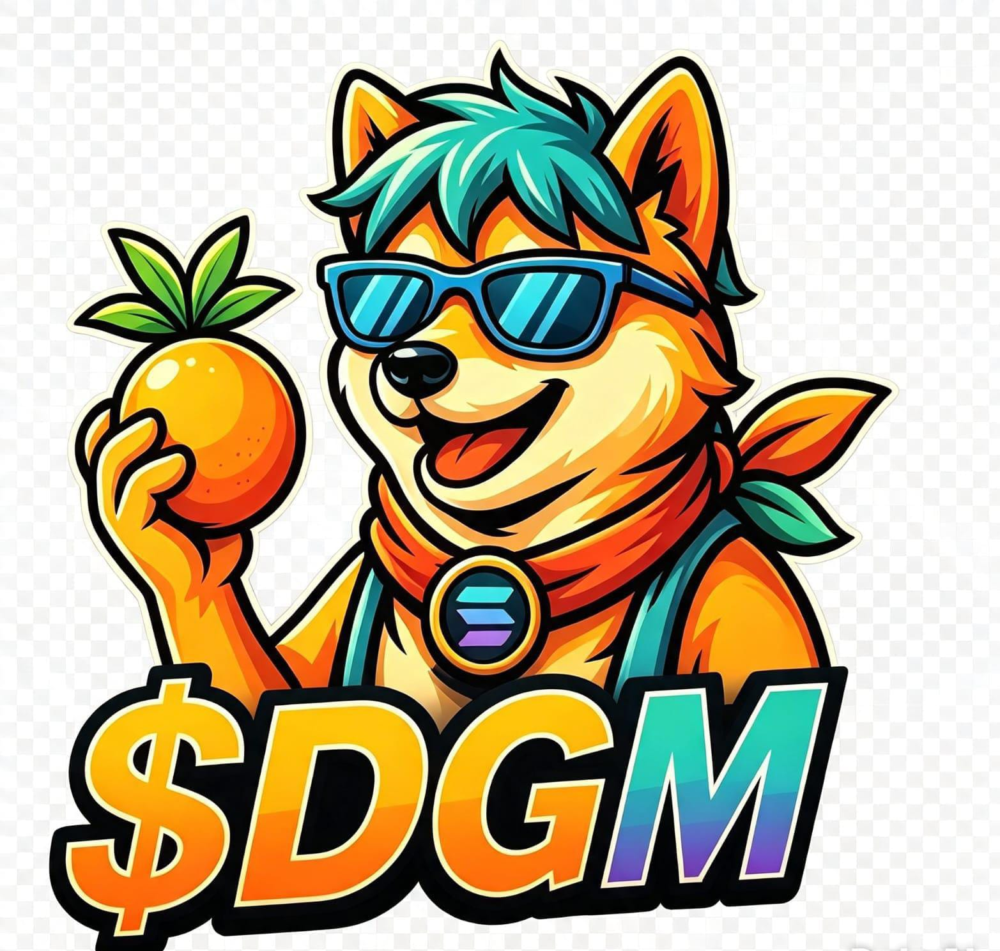

<p align="center">
  
</p>

<p align="center">
  
</p>

<h1 align="center">🐶 DogeManga ($DGM)</h1>

<p align="center">
<b>Powered by Solana • Built by Community • Inspired by Dogecoin, PepeCoin & Manga Culture</b>
</p>

<p align="center">

<a href="https://dogemangaofficial.xyz">🌐 Website</a> •
<a href="WHITEPAPER.md">📄 Whitepaper</a> •
<a href="https://x.com/dogemanga96508">𝕏 X</a> •
<a href="https://t.me/+fRrBfGscm9Y3OWEx">💬 Telegram</a>

</p>

<p align="center">

<a href="https://solscan.io/token/E9qgVy6urPUrKBv3wymPSgSPbDGM5z77ZnVok4YvUmqE">🔎 Solscan</a> •
<a href="https://birdeye.so/token/E9qgVy6urPUrKBv3wymPSgSPbDGM5z77ZnVok4YvUmqE?chain=solana">📈 Birdeye</a> •
<a href="https://dexscreener.com/solana/E9qgVy6urPUrKBv3wymPSgSPbDGM5z77ZnVok4YvUmqE">📉 DexScreener</a>

</p>

<p align="center">

<a href="https://raydium.io/swap/?inputMint=sol&outputMint=E9qgVy6urPUrKBv3wymPSgSPbDGM5z77ZnVok4YvUmqE">🌊 Raydium</a> •
<a href="https://app.meteora.ag/E9qgVy6urPUrKBv3wymPSgSPbDGM5z77ZnVok4YvUmqE">💧 Meteora</a> •
<a href="https://phantom.com/tokens/solana/E9qgVy6urPUrKBv3wymPSgSPbDGM5z77ZnVok4YvUmqE">👻 Phantom</a>

</p>

---

# 📖 About DogeManga

**DogeManga ($DGM)** is a community-driven memecoin developed on the **Solana Blockchain**, inspired by the strength of **Dogecoin**, the creativity of **PepeCoin**, and the unique culture of manga.

Our mission is to build a transparent, decentralized and community-first ecosystem while expanding the DogeManga brand throughout the Web3 universe.

DogeManga is an independent project created for long-term development, innovation and community participation.

---

# 🌐 Official Website

### 🌍 Website

https://dogemangaofficial.xyz

---

# 📱 Official Community

### 𝕏 X (Twitter)

https://x.com/dogemanga96508

### 💬 Telegram

https://t.me/+fRrBfGscm9Y3OWEx

---

# 🪙 Token Information

| Item | Information |
|------|-------------|
| Project Name | DogeManga |
| Symbol | $DGM |
| Blockchain | Solana |
| Contract | `E9qgVy6urPUrKBv3wymPSgSPbDGM5z77ZnVok4YvUmqE` |
| Total Supply | 420,000,000,000 DGM |
| Decimals | 6 |
| Category | Community Memecoin |

---

# ⚠️ Official Contract Notice

The address below is the **one and only official DogeManga ($DGM) smart contract** deployed on the Solana blockchain.

## 📜 Official Contract

```text
E9qgVy6urPUrKBv3wymPSgSPbDGM5z77ZnVok4YvUmqE
```

Always verify this contract address before buying, selling, swapping or interacting with the DogeManga token.

Any other contract claiming to represent DogeManga ($DGM) is **NOT OFFICIAL** and should not be trusted.

---

# 🎯 Project Mission

To create a transparent, decentralized and sustainable Web3 ecosystem where the community actively participates in the evolution of the project.

---

# 👀 Project Vision

To become one of the leading community-driven meme projects on the Solana Blockchain while expanding the DogeManga ecosystem worldwide.

---

# 💎 Core Values

- Transparency
- Security
- Community First
- Innovation
- Sustainability
- Long-Term Development

---
# 📊 Blockchain Explorer

### 🔎 Solscan

https://solscan.io/token/E9qgVy6urPUrKBv3wymPSgSPbDGM5z77ZnVok4YvUmqE

The official Solscan page allows anyone to verify the smart contract, token supply, holders, transfers and on-chain activity.

---

# 📈 Market Tracking

### 📈 Birdeye

https://birdeye.so/token/E9qgVy6urPUrKBv3wymPSgSPbDGM5z77ZnVok4YvUmqE?chain=solana

Track the token price, holders, market data and trading activity.

### 📉 DexScreener

https://dexscreener.com/solana/E9qgVy6urPUrKBv3wymPSgSPbDGM5z77ZnVok4YvUmqE

Monitor charts, liquidity, market capitalization and real-time trading.

---

# 💱 Trade DogeManga

### 🌊 Raydium

https://raydium.io/swap/?inputMint=sol&outputMint=E9qgVy6urPUrKBv3wymPSgSPbDGM5z77ZnVok4YvUmqE

Trade DogeManga directly on Raydium.

### 💧 Meteora

https://app.meteora.ag/E9qgVy6urPUrKBv3wymPSgSPbDGM5z77ZnVok4YvUmqE

Liquidity pools and decentralized trading.

---

# 👛 Wallet Support

### 👻 Phantom Wallet

https://phantom.com/tokens/solana/E9qgVy6urPUrKBv3wymPSgSPbDGM5z77ZnVok4YvUmqE

Compatible with Phantom Wallet for storing and managing DogeManga tokens.

---

# 📄 Documentation

- 📄 [Official Whitepaper](WHITEPAPER.md)
- 📘 README
- 🗺️ Roadmap *(Coming Soon)*
- 📊 Tokenomics *(Coming Soon)*
- ❓ FAQ *(Coming Soon)*
- ⚖️ License *(Coming Soon)*

---

# 🗺️ Roadmap

## ✅ Phase 1 — Foundation

- Token creation
- Brand identity
- Official Website
- Whitepaper
- GitHub Repository
- Community Launch
- Social Media Setup
- Solscan Listing
- Birdeye Listing
- DexScreener Tracking

---

## 🔄 Phase 2 — Growth

- Community expansion
- Marketing campaigns
- Strategic partnerships
- Liquidity growth
- Ecosystem improvements
- Brand awareness
- Global exposure

---

## ⏳ Phase 3 — Expansion

- New Web3 utilities
- NFT integrations
- Community events
- Strategic collaborations
- Ecosystem expansion
- Global community growth

---

## 🚀 Phase 4 — Future

- Long-term ecosystem development
- New decentralized products
- Additional utilities
- Worldwide adoption
- Continuous innovation

---

# 📊 Tokenomics

| Allocation | Description |
|------------|-------------|
| Community | Community growth and ecosystem participation |
| Liquidity | Liquidity pools and decentralized exchanges |
| Marketing | Promotion and global expansion |
| Development | Continuous improvement of the ecosystem |
| Strategic Reserve | Long-term sustainability |

---

# 🔐 Security

The DogeManga project prioritizes transparency and security.

Always verify the official contract address before interacting with the token.

Only use the official links published in this repository and through DogeManga's official social channels.

---
# 🌎 Community

DogeManga is a community-driven project built on transparency, collaboration and long-term development.

Every holder, supporter and community member plays an important role in helping the ecosystem grow.

Together we aim to build one of the strongest meme communities on the Solana Blockchain.

---

# 🤝 Join DogeManga

Become part of the DogeManga ecosystem by following our official channels and participating in the community.

### 🌍 Official Website

https://dogemangaofficial.xyz

### 𝕏 X (Twitter)

https://x.com/dogemanga96508

### 💬 Telegram

https://t.me/+fRrBfGscm9Y3OWEx

---

# 📚 Official Resources

### 📄 Whitepaper

Official technical documentation of the DogeManga project.

### 📊 Solscan

Official blockchain explorer.

### 📈 Birdeye

Official market tracking platform.

### 📉 DexScreener

Official chart and trading analytics.

### 🌊 Raydium

Official decentralized trading platform.

### 💧 Meteora

Official liquidity platform.

### 👻 Phantom Wallet

Compatible wallet for storing and managing DogeManga ($DGM).

---

# ⚡ Why DogeManga?

- Community Driven
- Built on Solana
- Fast Transactions
- Low Fees
- Transparent Development
- Secure Smart Contract
- Long-Term Vision
- Independent Project
- Inspired by Dogecoin, PepeCoin & Manga Culture

---

# 📢 Official Announcement

Only trust the links published in this GitHub repository and through DogeManga's official communication channels.

Always verify the official contract before buying, trading or interacting with the token.

Official Contract:

```text
E9qgVy6urPUrKBv3wymPSgSPbDGM5z77ZnVok4YvUmqE
```

Any other contract claiming to represent DogeManga ($DGM) is **NOT OFFICIAL**.

---

# ⚠️ Disclaimer

DogeManga ($DGM) is a decentralized digital asset built for educational, technological and community purposes.

Cryptocurrency investments involve risk and market volatility.

Nothing contained in this repository should be interpreted as financial or investment advice.

Always **Do Your Own Research (DYOR)** before interacting with any digital asset.

---

# ❤️ Special Thanks

A sincere thank you to every community member supporting the DogeManga project.

Your participation helps build a stronger and more transparent ecosystem every day.

Together, we continue to shape the future of DogeManga.

---

<p align="center">

# 🐶 DogeManga ($DGM)

### Powered by Solana

### Built by Community

### Inspired by Dogecoin • PepeCoin • Manga Culture

🌐 Website  
https://dogemangaofficial.xyz

𝕏 X (Twitter)  
https://x.com/dogemanga96508

💬 Telegram  
https://t.me/+fRrBfGscm9Y3OWEx

📄 Whitepaper  
WHITEPAPER.md

**© DogeManga Project. All Rights Reserved.**

</p>
